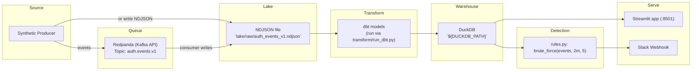
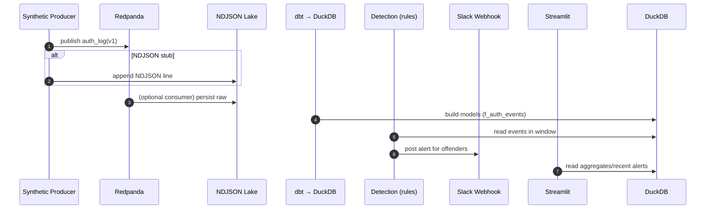

# High-Level Design (M1)

Local pipeline from synthetic auth events to detections and alerts, with a simple dashboard.

## Architecture Overview
- Producers → Redpanda (or NDJSON file) → Lake (NDJSON) → dbt → DuckDB → Detection → Slack + Streamlit

## Sequence (M1 happy path)

## Data Contract
- `auth_log(v1)`: `ts`, `user_id`, `ip`, `user_agent`, `action ∈ {login}`, `result ∈ {success,fail}`.
  - Format: JSON over Kafka or NDJSON; one event per message/line.
  - Time is UTC ISO8601 with trailing Z.

## Interfaces
- Input topic: `auth.events.v1` (Kafka/Redpanda). Optional stub via file `lake/raw/auth_events_v1.ndjson`.
- Warehouse: DuckDB path `${DUCKDB_PATH}`. dbt target profile set accordingly.
- Detection function: `brute_force(events, window_minutes=2, threshold=5) -> list[user_id]`.
- Alerts: Slack webhook URL via `${SLACK_WEBHOOK_URL}`.
- Dashboard: Streamlit on `${STREAMLIT_PORT:-8501}`.

## Configuration (env)
- `KAFKA_BROKER`: Kafka/Redpanda bootstrap servers (e.g., `localhost:9092`).
- `DUCKDB_PATH`: path to local DuckDB file (e.g., `./warehouse/logpulse.duckdb`).
- `SLACK_WEBHOOK_URL`: Slack Incoming Webhook URL.
- `STREAMLIT_PORT` (optional, default `8501`).

## SLOs (M1)
- Time-to-first-event < 10 minutes using documented commands.
- Detection alert latency < 5 seconds at 1k events/min synthetic rate.
- Bootstrap script generates ≥10k events and triggers at least one brute-force alert.

## Milestones
- M1: Local demo (this document).
- M2+: anomaly detection, IP/UA enrichment, one-click demo.
