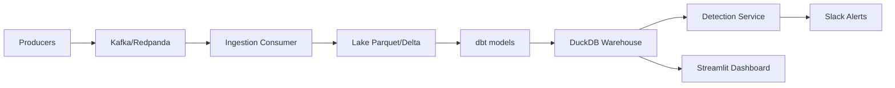

# High-Level Design
Producers → Kafka (Redpanda) → Ingestion Consumer → Lake (Parquet/Delta) → dbt → Warehouse (DuckDB) → Detection service → Alerts (Slack) + Dashboard (Streamlit).

## Data Contracts
- auth_log(v1): ts, user_id, ip, user_agent, action, result
- web_log(v1): ts, session_id, ip, path, status

## Interfaces
- Detection reads curated tables: dim_ip, f_auth_events.
- Alerts via SLACK_WEBHOOK_URL env var.

## SLOs
- Pipeline success 99.9% (local CI emulation)
- MTTR < 10 min (runbook)

Milestones

M1: Local demo (DuckDB + Redpanda), rules-only detection, Slack alert, dashboard basics.

M2: Anomaly detection, IP intel cache, one-click demo.

